Some plots here - 

## Predicted maps for Pendulum

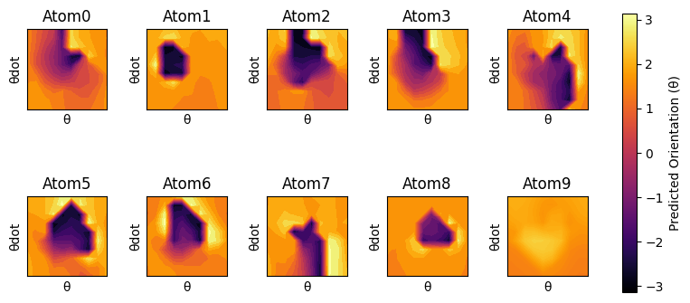
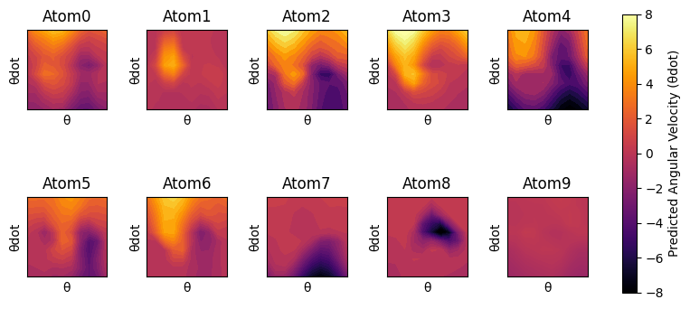

-----------------------------------

## Predicted X and Y Rate Maps for Different Policies in the RatInABox (RiaB) Environment

### Policy 1 - Random Walk
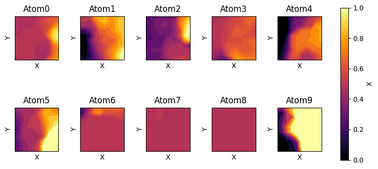
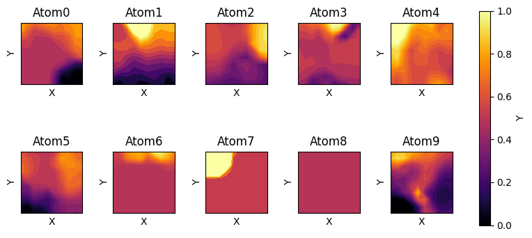

### Policy 2 - Goal-Directed
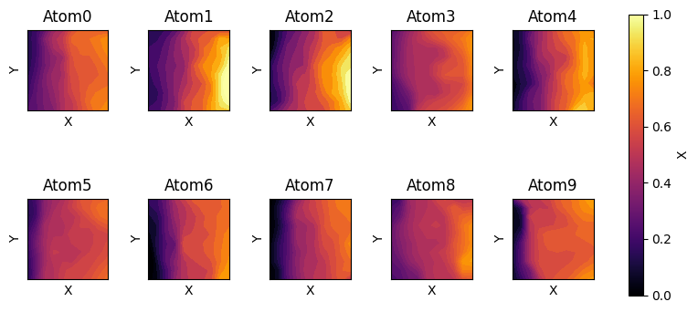

### Policy 3 - High Thigmotaxis
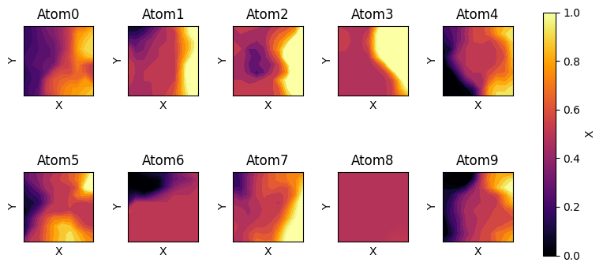
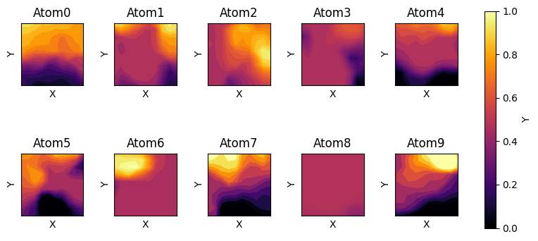

### Policy 4 - Teleport
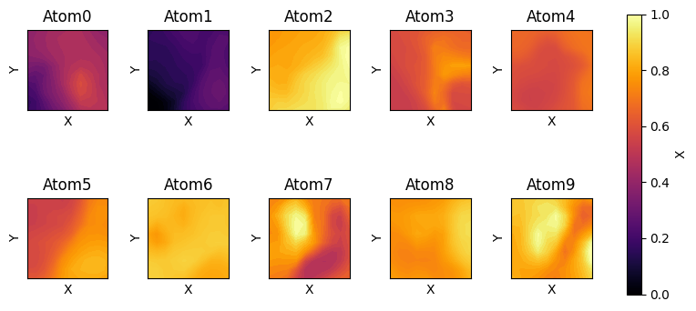
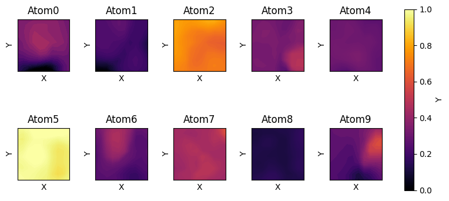

### Policy 4 - Constrained (Wall)
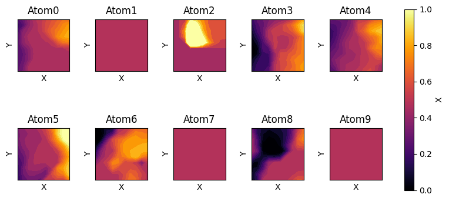
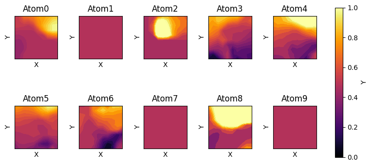

-----------------------------------

### Remapping exp: 

Averaged rate map of a place cell - with increasing alterations to the environment: DSM

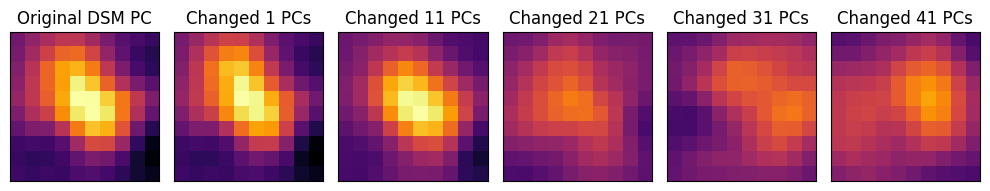

#### Cosine similarity between the original and modified predicted rate maps for the DSM and SR models 

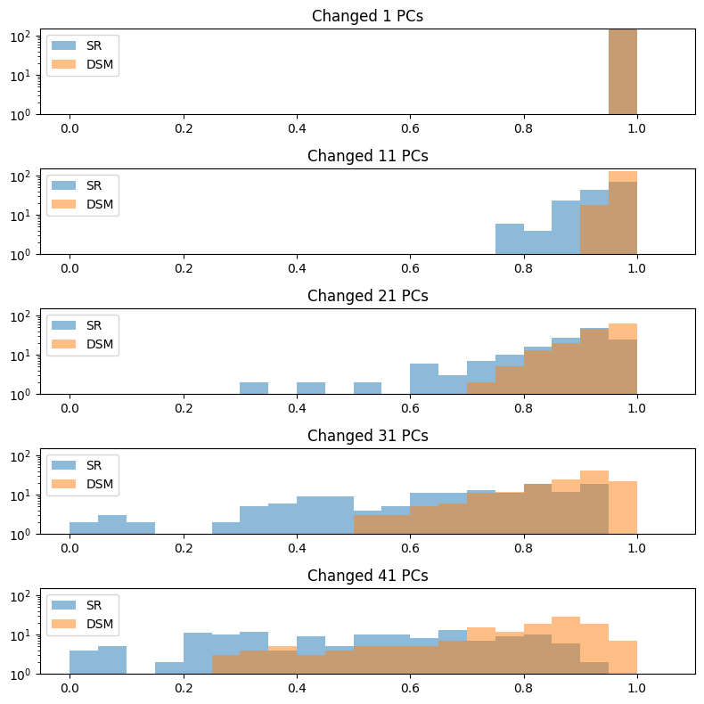
